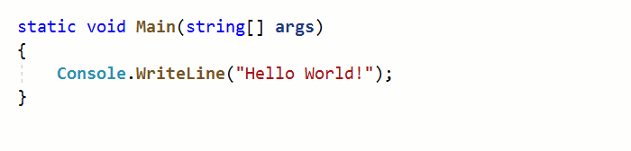
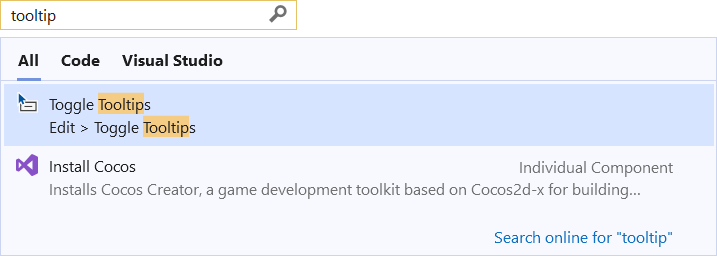

# Toggle Editor Tooltips

Disable editor tooltips on mouse hover to remove the visual noise 

Download the extension at the
[Visual Studio Marketplace](https://marketplace.visualstudio.com/items?itemName=MadsKristensen.ToggleEditorTooltips)
or try the
[CI build](http://vsixgallery.com/extension/1d076908-c0d7-4d92-b528-4b14a35ff4c5/).

---------------------------------------

Editor tooltips, also known as QuickInfo tooltips, are really helpful, but for some scenarios they can add too much visual noise.

Being able to disable the tooltips might be particularly helpful during presentations, screencasts, or video recordings.

### Toggle

To toggle the tooltips on and off, use the search field (Ctrl+Q) and search for **tooltip**. 

Clicking the **Toggle Tooltips** item in the search result will enable or disable the tooltips and the status bar will reflect the new state.

## License
[Apache 2.0](LICENSE)
