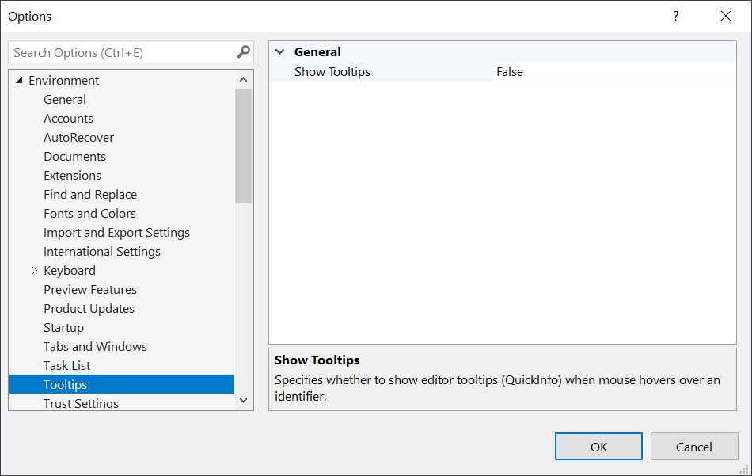

# Toggle Editor Tooltips

Disable editor tooltips on mouse hover to remove the visual noise 

Download the extension at the
[Visual Studio Marketplace](https://marketplace.visualstudio.com/items?itemName=MadsKristensen.CodeCleanupOnSave)
or try the
[CI build](http://vsixgallery.com/extension/1d076908-c0d7-4d92-b528-4b14a35ff4c5/).

---------------------------------------

Disabling the hover tooltips, also known as the QuickInfo tooltips, removes visual noise that can be helpful during presentations, screencasts, or video recordings.

### Toggle command

To toggle the tooltips on and off, use the search field (Ctrl+Q) and search for "tooltip". 

Clicking the **Toggle Toolbar** item in the search result will toggle the setting and the status bar will reflect the new state.

### Options
The options page allows you to chose between which profile to run automatically on save.

## License
[Apache 2.0](LICENSE)
